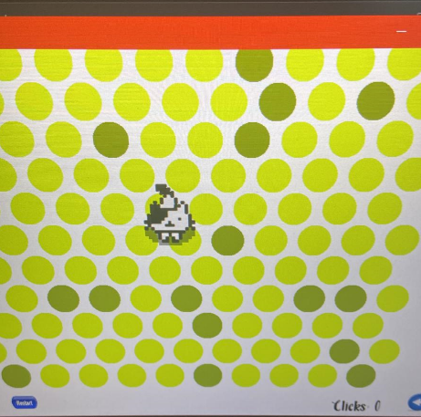

# Circle-The-Cat-Game-BFS-algorithm

  

## Tools/Frameworks:
* 
* 

# About the Game
Circle the Cat is a puzzle game where you draw circles by clicking the dots around a cat in an attempt to trap it,  the cat can be quite tricky by using BFS-algorithm, you have to stop the cat from escaping!.

# Algorithm BFS (Breadth-First Search)
The Breadth-First Search (BFS) algorithm is utilized in this game to find the shortest path for the cat to escape. It explores all the neighbor nodes at the present depth prior to moving on to the nodes at the next depth level.

# How to Play:
Click the circles to create a barrier. Capturing the cat can be quite tricky. It’s best to start from further away from the cat, because if you build too close, that cat will always find a way to escape!

When you’ve figured it out and built a fairly wide, closed perimeter, you must then fill it with circles until the cat has no circles to jump to. At this point, you’ve circled the cat, and the next new random level starts again.

# Controls:
Use your mouse to play this game.
